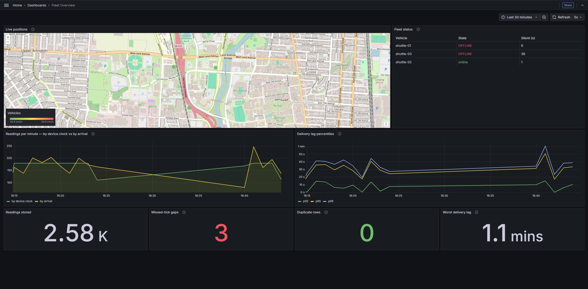

# Campus Shuttle Telemetry


A telemetry platform for a campus shuttle fleet: simulated vehicles publish position
and state over MQTT, an ingestion service writes to a TimescaleDB hypertable, a
detector turns that stream into alert episodes, and a REST API serves live positions,
historical tracks and alerts.

Built to answer a specific question — what does it actually take to keep a fleet's
worth of unreliable, intermittently-connected devices producing data you can trust
enough to put on a map and bill against.

**Headline result:** over a 67-minute run the vehicle was unreachable for roughly
92% of the time, across 123 separate outages. Zero readings lost, zero duplicate
rows. The [queries and their output](#fault-injection-slice-2) are below.

**Status:** slices 1–5 complete, slice 6 partial. Runs under Docker Compose or
Kubernetes. See [Roadmap](#roadmap) for what is next.

---

## Architecture

```
┌──────────────┐   MQTT (QoS 1)   ┌────────────┐
│  simulator   │ ───────────────► │ mosquitto  │
│ N vehicles   │  fleet/{id}/…    │  broker    │
└──────────────┘                  └─────┬──────┘
                                        │  fleet/+/telemetry
                                        │  fleet/+/status
                                        ▼
                                 ┌────────────┐
                                 │  ingest    │  validate → buffer → batch insert
                                 └─────┬──────┘
                                       │
                                       ▼
                              ┌──────────────────┐        ┌────────────┐
                              │   TimescaleDB    │◄──────►│  detector  │
                              │ telemetry, zone, │        │ episodes,  │
                              │ alert, cursor    │        │ watermark  │
                              └───┬──────────┬───┘        └────────────┘
                                  │          │
                                  ▼          ▼
                          ┌────────────┐  ┌────────────┐
                          │    api     │  │  grafana   │
                          │ REST +     │  │ provisioned│
                          │ OpenAPI    │  │ dashboards │
                          └────────────┘  └────────────┘
```

Each simulated vehicle holds its own broker connection with its own last-will
message, because that is how the real units behave and it is what makes offline
detection work without a heartbeat table.



The readings-per-minute panel is the design in one picture. During an outage the
*by arrival* line collapses and then spikes as the backlog lands, while the
*by device clock* line stays flat at the true sample rate — the journey was never
interrupted, only its delivery. The gap and duplicate tiles are the integrity
queries from [below](#fault-injection-slice-2), running live; they turn red if
either stops being zero.

[Watch the dashboard during an outage](https://github.com/user-attachments/assets/90317c0b-7824-4870-90c9-a60a5d2732b3) — 45 seconds: three
vehicles reporting, coverage lost, the arrival line collapsing while the device
clock line holds, and the backlog landing on reconnect with the integrity tiles
still at zero.

## Running it

```bash
cp .env.example .env
docker compose up --build
```

Then:

| What | Where |
|---|---|
| Grafana dashboards | http://localhost:3001 |
| API docs (Swagger UI) | http://localhost:3000/docs |
| Live fleet positions | http://localhost:3000/fleet/positions |
| Open alerts | http://localhost:3000/alerts?open=true |
| Health | http://localhost:3000/health |
| Ingest rate, last hour | http://localhost:3000/metrics/ingest |

Grafana is provisioned from `grafana/provisioning/` — datasource and dashboard both
come from the repo, and anonymous viewers get read access, so there is nothing to
click together after a clone.

Watch a vehicle move:

```bash
watch -n1 'curl -s localhost:3000/vehicles/shuttle-01/latest | jq'
```

Raise the fleet size with `FLEET_SIZE=50` in `.env` and restart the simulator.
Vehicles are spread evenly around the loop so they do not convoy.

To watch the failure modes rather than the happy path, turn up the fault injection
(`DROPOUT_CHANCE=0.5` and friends — see [Fault injection](#fault-injection-slice-2))
and follow the simulator log:

```bash
docker compose logs -f simulator | grep -E 'coverage|replaying|redelivered'
```

To watch alerts open and close, lower the speed limit below the 30 km/h cruise
(`SPEED_LIMIT_KPH=25`) and follow the detector:

```bash
docker compose logs -f detector
```

## CI

Every push stands up the whole stack on a clean runner, runs it for two minutes with
fault injection turned up, and then asserts against what actually reached the
database:

- readings are being written at all
- buffered replay was observed
- zero missed ticks in the reconstructed track
- zero duplicate rows
- zero messages rejected by validation
- read path monotonic on `device_ts`
- API healthy and serving live positions

The second assertion is the one that matters most. Without it the integrity checks
would pass trivially on a run where nothing ever disconnected, and a test that can
pass without exercising the thing it tests is worse than no test at all. The checks
live in [`ci/verify.sh`](ci/verify.sh) rather than inside the workflow YAML, so they
are readable and runnable locally.

## Design notes

**Two clocks, deliberately.** Every reading stores `device_ts` (the clock on the
vehicle) and `received_at` (when we accepted it). They are not the same, and
conflating them is the bug that quietly ruins telematics data. A unit that buffers
through an underpass replays four minutes of readings at once: by arrival order the
track teleports, by device order it is correct. Every read path sorts on `device_ts`;
the gap between the two is itself a useful metric, exposed at `/metrics/ingest`.

**Idempotent writes.** MQTT QoS 1 is at-least-once, so duplicates are a matter of
when, not if. The primary key is `(vehicle_id, device_ts)` and inserts are
`ON CONFLICT DO NOTHING`. Replays and redeliveries are therefore free, which is what
lets the buffering behaviour in slice 2 be simple.

**Batched inserts.** Readings accumulate in memory and flush as a single multi-row
INSERT every 500 ms or 200 messages, whichever comes first. At one vehicle this is
pointless; at a few hundred it is the difference between a working ingest path and
a connection-starved one. A failed flush returns the batch to the buffer rather than
dropping it.

**Drop oldest, not newest.** A device buffering offline has finite storage. When the
buffer fills, the oldest readings are discarded and counted. This is an operational
tool: a dispatcher asking where a vehicle is now needs the newest reading, and a
reading from forty minutes ago is worth almost nothing by comparison. A tachograph or
a billing-by-distance system would make the opposite choice, because there a gap is a
compliance failure.

**Malformed input is data, not an outage.** Validation rejects and counts bad
readings per reason. One bad firmware build should not stop ingestion for the fleet.

**No geo library.** Campus loops are single-digit kilometres, so an equirectangular
projection about the route centroid is sub-metre accurate and the motion model stays
readable. At country scale this would be wrong and would need proper geodesics.

## Fault injection (slice 2)

Slice 1 proved the happy path. Slice 2 exists because the happy path is not the
interesting part: real units lose coverage under bridges and in parking structures,
buffer what they cannot send, then dump the backlog at the broker the moment the
link returns — out of order, and sometimes twice. The simulator now produces all of
that on purpose, and the claims below are queries run against the running stack.

Knobs, all in `.env`:

| Variable | Meaning | Value used below |
|---|---|---|
| `DROPOUT_CHANCE` | per-tick probability of losing coverage | `0.5` |
| `DROPOUT_MIN_SEC` / `DROPOUT_MAX_SEC` | outage length | `15` / `45` |
| `MAX_BUFFER` | readings held offline before the oldest is discarded | `3600` |
| `REPLAY_SHUFFLE` | replay the backlog out of order rather than oldest-first | `true` |
| `DUPLICATE_CHANCE` | per-reading chance of a QoS-1 redelivery | `0.02` |

Coverage loss is a real socket drop — `client.end(true)`, no DISCONNECT packet — so
the broker sees a dead client and publishes the vehicle's last will. Offline
detection is not simulated at a higher layer; it is the actual MQTT mechanism.

The run measured below is a single continuous 67-minute window of the fixed build,
captured 2026-09-14 11:43:21–12:50:00 UTC: **one vehicle at 1 Hz, 123 outages,
122 replays, 3835 readings replayed, 72 deliberate redeliveries.** At an average
outage of roughly 30 seconds, that leaves under three seconds of connectivity
between outages — the vehicle spent about 92% of the run unreachable. Every query is
pinned to that window, so the output reproduces against the stored data rather than
drifting with the clock.

### The disconnect-tick bug

The first version of the dropout code decided whether to buffer by asking the
client:

```js
const reading = veh.tick(dt);
if (!client.connected) { buffer(reading); continue; }   // wrong
client.publish(telemetryTopic(veh.id), JSON.stringify(reading), { qos: 1 });
```

On the tick that *starts* an outage, `maybeDropout()` has already called
`client.end(true)`, but the socket teardown is asynchronous and `client.connected`
is still `true`. So that one reading took the publish path into a socket that was
already going away, and was neither delivered nor buffered. Exactly one reading
lost per outage — small enough to look like jitter, and invisible unless you query
for it.

The fix is to trust the state machine that made the decision, not the transport:

```js
const online = maybeDropout();
const reading = veh.tick(dt);
if (!online || !client.connected) { buffer(reading); continue; }
```

Both builds' data is still in the hypertable, so the comparison is a single query.
A gap is two consecutive readings more than one tick apart:

```sql
WITH win(build, lo, hi) AS (VALUES
  ('1. before fix', TIMESTAMPTZ '2026-09-14 11:03:22', TIMESTAMPTZ '2026-09-14 11:16:50'),
  ('2. after fix',  TIMESTAMPTZ '2026-09-14 11:43:21', TIMESTAMPTZ '2026-09-14 12:50:00')
), d AS (
  SELECT w.build, t.device_ts,
         t.device_ts - lag(t.device_ts) OVER (PARTITION BY w.build ORDER BY t.device_ts) AS gap
  FROM win w JOIN telemetry t
    ON t.vehicle_id = 'shuttle-01' AND t.device_ts >= w.lo AND t.device_ts < w.hi
)
SELECT build,
       round(extract(epoch FROM max(device_ts) - min(device_ts)) / 60) AS minutes,
       count(*) AS readings,
       count(*) FILTER (WHERE gap > interval '1.5 s') AS missed_tick_gaps
FROM d GROUP BY build ORDER BY build;
```

```
     build     | minutes | readings | missed_tick_gaps
---------------+---------+----------+------------------
 1. before fix |      13 |      789 |               16
 2. after fix  |      67 |     3995 |                0
(2 rows)
```

Every one of those 16 gaps was exactly `00:00:02.002` — a single missing tick,
one per outage, which is the bug's signature. A stall would produce gaps of varying
length; sixteen identical two-second holes is this bug and nothing else. After the
fix, 67 minutes and 123 outages produce an unbroken 1 Hz series: 3995 readings, no
gap wider than a tick.

Worth stating plainly: nobody would have found this by reading the code. It only
surfaced because the verification query counted something that could be wrong.

### Duplicates are free

MQTT QoS 1 is at-least-once, so the simulator redelivers a fraction of replayed
readings deliberately. The primary key is `(vehicle_id, device_ts)` and every
insert is `ON CONFLICT DO NOTHING`, so redelivery is a no-op rather than a
correction job:

```sql
SELECT count(*)                                            AS rows_stored,
       count(DISTINCT (vehicle_id, device_ts))             AS distinct_keys,
       count(*) - count(DISTINCT (vehicle_id, device_ts))  AS duplicate_rows
FROM telemetry
WHERE vehicle_id = 'shuttle-01'
  AND device_ts >= TIMESTAMPTZ '2026-09-14 11:43:21'
  AND device_ts <  TIMESTAMPTZ '2026-09-14 12:50:00';
```

```
 rows_stored | distinct_keys | duplicate_rows
-------------+---------------+----------------
        3995 |          3995 |              0
(1 row)
```

72 redeliveries were published by the simulator over that window. None of them
reached the table as a row.

This is a deliberate trade. QoS 2 would guarantee exactly-once delivery, but it
costs a four-step handshake per message, and at a few hundred vehicles on cellular
data that is not worth paying for. Taking the cheaper at-least-once guarantee and
absorbing the consequence in the schema is the better deal — and it costs no
application code at all.

### Out-of-order arrival is the normal case

A reconnecting device does not politely send its backlog oldest-first, so the
simulator shuffles it. A reading counts as out of order if something with a later
`device_ts` had already been accepted before it arrived:

```sql
WITH t AS (
  SELECT device_ts, received_at,
         max(device_ts) OVER (ORDER BY received_at
                              ROWS BETWEEN UNBOUNDED PRECEDING AND 1 PRECEDING) AS max_seen
  FROM telemetry
  WHERE vehicle_id = 'shuttle-01'
    AND device_ts >= TIMESTAMPTZ '2026-09-14 11:43:21'
    AND device_ts <  TIMESTAMPTZ '2026-09-14 12:50:00'
)
SELECT count(*) AS readings,
       count(*) FILTER (WHERE device_ts < max_seen) AS arrived_out_of_order,
       round(100.0 * count(*) FILTER (WHERE device_ts < max_seen) / count(*), 1) AS pct,
       max(received_at - device_ts) AS worst_lag
FROM t;
```

```
 readings | arrived_out_of_order | pct  |    worst_lag
----------+----------------------+------+-----------------
     3995 |                 3352 | 83.9 | 00:00:45.111514
(1 row)
```

84% of readings arrived after something newer. That is not an edge case handled
defensively — it is the dominant condition, and any system that assumed arrival
order would be wrong most of the time. Worst lag is 45.1 s, which is exactly
`DROPOUT_MAX_SEC`: the backlog is bounded by the outage length, which is how you
know the buffer is not leaking.

This is the payoff for storing two clocks. Ordered by arrival the track is
nonsense; ordered by `device_ts` it is correct, and the read path does the latter:

```bash
curl -s "localhost:3000/vehicles/shuttle-01/track?from=2026-09-14T12:00:00Z&to=2026-09-14T12:05:00Z"
```

```
count: 300
device_ts strictly increasing: True
received_at increasing      : False
```

300 readings for a 300-second window at 1 Hz: nothing lost, nothing duplicated,
and monotonic on the vehicle clock even though 84% of it arrived late and jumbled.

### Not done yet: clock skew

Every reading here carries a device clock that is merely *late*, never *wrong*.
Real units drift, and some come back from a cold boot in 1970 or a few hours off,
which breaks a `(vehicle_id, device_ts)` primary key in a way buffering does not —
two genuinely different readings can collide, and `ON CONFLICT DO NOTHING` would
silently discard the second. The same mechanism that makes duplicates free makes
skew lossy. Fixing it properly means a sequence-aware key or a skew correction on
ingest, so it is deliberately held back rather than half-implemented.

## Domain layer (slice 3)

Slices 1 and 2 move readings from devices to a database and serve them back. That is
a pipe. Slice 3 is what makes it a platform: a `detector` service that turns the
position stream into things an operator would act on — a bus in a restricted zone, a
bus over the limit, a bus that has gone dark.

Three alert types, each with its own closing condition:

| Type | Subject | Opens when | Closes when |
|---|---|---|---|
| `speeding` | — (or a zone id) | speed above the limit | a reading shows it back under, or timeout |
| `zone_violation` | zone id | inside a forbidden zone, or outside a required one | a reading shows it compliant, or timeout |
| `offline` | — | no reading for `OFFLINE_AFTER_SEC` | a reading arrives |

Zones are polygons with a rule. `inside_allowed = true` means the vehicle must stay
in (a campus boundary); `false` means it must stay out (a service yard). One shape,
two opposite rules, so the detector has one code path and only the comparison flips.
Point-in-polygon is ray casting in about fifteen lines — no PostGIS, for the same
reason there is no geo library in the simulator.

### Episodes, not instants

The first design decision, and the one everything else follows from.

A bus speeding for forty seconds at 1 Hz produces forty violating readings. Storing
one alert per reading gives an operator forty rows for one event and a dashboard
nobody can read. So an alert is an **episode**: it opens when the condition starts
and closes when it stops.

That makes the natural key `(vehicle_id, alert_type, subject, opened_at)`. Each part
earns its place:

- **`opened_at` is the device clock**, not the detection time. Reprocess the same
  window and you compute the same opening timestamp, so the insert collapses under
  `ON CONFLICT DO NOTHING` — the same idempotency trick as the telemetry writes, one
  layer up. A vehicle leaving and re-entering a zone fifteen times is fifteen
  episodes, because each has a different `opened_at`.
- **`subject` names what the alert is about** — a zone id, empty for alerts with no
  subject. Without it, two overlapping zones violated simultaneously would collide on
  the key and the second violation would be silently discarded. That is the same
  failure mode as the clock-skew hole above: the mechanism that makes duplicates free
  makes genuinely distinct things collide.

### Where detection runs, and why it is deliberately late

Three options were on the table: evaluate inside `ingest` as each message arrives,
run a second MQTT subscriber, or poll the database. The first two are lower latency
and both are wrong here.

84% of readings arrive after something newer. A detector reading the live stream
would evaluate a reading from forty seconds ago against state built from readings
that came after it — firing exit alerts for conditions that ended half a minute
earlier, and firing them again on every replay.

So the detector polls the database in `device_ts` order, behind a **watermark**: it
only looks at readings older than `now() - WATERMARK_SEC`. At 60 seconds, against a
measured worst delivery lag of 45.1 s, everything around a reading has almost
certainly arrived by the time it is evaluated, and processing in device order is
safe.

That is a minute of deliberate lag bought in exchange for correctness. A geofence
violation reported 60 seconds late is still actionable; one reported three times is
not.

Two consequences:

- **A cursor**, stored in `detector_cursor`, records how far processing has reached.
  It advances only on a successful cycle, so a failed cycle is retried rather than
  skipped — and because `reconcile()` will not reopen an episode it can see is open,
  reprocessing produces no duplicate alerts. State in the database rather than in
  memory is also what lets the detector run as a stateless Deployment: pods are
  replaced routinely, and an in-memory version would forget every open episode on
  each deploy and then reopen them all as new alerts.
- **The watermark advances regardless of silence.** A bus offline for two hours does
  not block it. When that backlog finally lands, those readings are older than the
  cursor and are skipped — so retrospective detection for very late data is lost.
  That is the right call for an operational alert and the wrong one for compliance,
  which would need a separate backfill job.

### Closed how, not just closed

An episode closes for one of two reasons, and the distinction is the point.

`resolved` means a reading proved the condition ended. `timed_out` means the vehicle
stopped reporting and we lost the ability to tell. A bus that sped for ten seconds
and slowed down, and a bus that sped for ten seconds and vanished, look identical if
you only record "no longer speeding".

So "not violating" only counts when a reading from that vehicle says so. Silence is
handled separately:

```
for each reading, in device_ts order:
    violations = evaluate(reading)
    open episodes for this vehicle NOT in violations → close as 'resolved'
    violations NOT already open                      → open new episode
    violations already open                          → update peak

after all readings:
    open episodes whose vehicle has no reading newer than (watermark - timeout)
        → close as 'timed_out'
```

`closed_at` for a timeout is the vehicle's **last known reading**, not the moment of
detection. Record detection time instead and every timed-out episode reads as three
minutes longer than it was, quietly skewing any duration statistic built on it.

**Sizing the timeout.** The obvious move is to reuse the watermark's 60 seconds. That
is too tight, because the two numbers measure different things. Worst case, an outage
starts at T, ends at T + 45 when the backlog lands, and the watermark holds those
readings for another 60 seconds before the detector sees them — so the closing
reading is not evaluated until T + 105. A 60-second timeout would have closed the
episode at T + 60 and the real close would arrive to find it already shut. The rule
is **timeout > max_outage + watermark**; the default is 120 seconds.

### The offline alert breaks the rule

`speeding` and `zone_violation` are computed from a reading. `offline` cannot be —
there is no reading. It is driven by `vehicle_status.last_seen`, which is maintained
from MQTT connect and last-will messages.

The first version fired, then immediately closed itself, then fired again:

```
OPEN  offline shuttle-02 at 22:18:21.857
CLOSE offline shuttle-02 (timed_out)
OPEN  offline shuttle-02 at 22:18:21.857
OPEN  offline shuttle-02 at 22:18:21.857
OPEN  offline shuttle-02 at 22:18:21.857
```

The timeout sweep closes any open episode whose vehicle has gone quiet — and an
offline episode is *about* the vehicle being quiet. So it opened, was immediately
timed out, and reopened on the next cycle, forever. The repeated OPEN lines with no
new rows are `ON CONFLICT DO NOTHING` absorbing them: the database was protecting the
data while the log lied and the detector burned a cycle every three seconds.

The fix is one line — offline episodes are excluded from the timeout sweep. The
general shape is worth naming, because it is the second time it has come up in this
project: a rule that is correct for every case considered when it was written, and
wrong for the case added afterwards.

With the exclusion in place, the same silence does two different things at once:

```
OPEN  offline shuttle-02 at 2026-09-17T22:24:50.944Z
CLOSE speeding shuttle-02 (timed_out)
OPEN  offline shuttle-01 at 2026-09-17T22:25:00.954Z
OPEN  offline shuttle-03 at 2026-09-17T22:25:00.954Z
CLOSE speeding shuttle-01 (timed_out)
CLOSE speeding shuttle-03 (timed_out)
```

Episodes about something observable close, because observation stopped. Episodes
about the absence of observation open, and stay open until a reading arrives.

### What it produces

```sql
SELECT vehicle_id, alert_type, subject, opened_at, closed_at, close_reason,
       round(EXTRACT(EPOCH FROM (closed_at - opened_at))) AS seconds
FROM alert ORDER BY opened_at DESC;
```

```
 vehicle_id |   alert_type   |   subject    |         opened_at          |         closed_at          | close_reason | seconds
------------+----------------+--------------+----------------------------+----------------------------+--------------+---------
 shuttle-03 | speeding       |              | 2026-09-17 20:45:36.483+00 | 2026-09-17 20:46:02.508+00 | timed_out    |      26
 shuttle-02 | speeding       |              | 2026-09-17 20:45:25.472+00 | 2026-09-17 20:46:06.513+00 | timed_out    |      41
 shuttle-01 | speeding       |              | 2026-09-17 20:45:03.447+00 | 2026-09-17 20:45:51.496+00 | resolved     |      48
 shuttle-03 | zone_violation | service-yard | 2026-09-17 20:44:41.423+00 | 2026-09-17 20:45:42.485+00 | resolved     |      61
 shuttle-02 | speeding       |              | 2026-09-17 20:44:06.392+00 | 2026-09-17 20:44:48.429+00 | resolved     |      42
 shuttle-03 | speeding       |              | 2026-09-17 20:44:06.392+00 | 2026-09-17 20:44:53.435+00 | resolved     |      47
 shuttle-01 | speeding       |              | 2026-09-17 20:44:06.392+00 | 2026-09-17 20:44:56.438+00 | resolved     |      50
```

Read as an operator would: buses speed for 42–50 seconds at a stretch, which is the
accelerate-cruise-decelerate rhythm between stops. `shuttle-03` spends 61 seconds in
the service yard on each pass — the same duration every time, which is what you would
expect from a fixed route and would investigate on a real fleet.

Live state through the API:

```bash
curl -s 'localhost:3000/alerts?open=true'
```

```json
{
  "count": 1,
  "alerts": [
    {
      "vehicleId": "shuttle-02",
      "alertType": "zone_violation",
      "subject": "service-yard",
      "openedAt": "2026-09-17T21:57:41.345Z",
      "closedAt": null,
      "closeReason": null,
      "lat": 40.003037,
      "lon": -83.0332,
      "detail": { "rule": "must_stay_outside", "zoneName": "Service yard" },
      "durationSec": 91
    }
  ]
}
```

`durationSec` on an open episode counts to now, so it grows on each request — which
is what a dispatcher watching a live incident wants.

### Not done yet

**Schedule adherence.** Detecting arrival at a stop from a position stream — rather
than being told about it — is a bigger problem than the three alert types combined,
and it needs its own slice.

**Offline detection is live-only.** It reads `vehicle_status`, which holds one
current row per vehicle with no history, so it cannot reconstruct a past silence the
way the other two types reconstruct from stored telemetry. If the detector is down
while a vehicle is offline and both recover, that outage goes unrecorded. Catching it
would mean detecting gaps in `telemetry` rather than reading current state.

**Driver assignment and scheduled lock/unlock** are in the original scope and
deliberately cut. Both are CRUD around a user model that does not exist yet, and
neither demonstrates anything the three implemented types do not.

## Kubernetes (slice 5)

The same stack runs on Kubernetes, in `k8s/`. Compose was the right tool for building
it; Kubernetes is where the stateful-versus-stateless distinction stops being
theoretical.

```bash
# images are local, so load them into the cluster's containerd store first
docker compose build
docker save campus-shuttle-telemetry-ingest:latest -o ingest.tar
docker cp ingest.tar <node>:/ingest.tar
docker exec <node> ctr -n k8s.io images import /ingest.tar
# …repeat for api, simulator and detector

# the schema is generated from the file rather than duplicated in YAML
kubectl create configmap timescale-init --from-file=db/init/001_schema.sql

kubectl apply -f k8s/
kubectl port-forward service/api 3000:3000
```

**TimescaleDB is a StatefulSet, everything else is a Deployment.** A Deployment
treats pods as interchangeable — any one can be replaced by any other, in any order.
A database cannot work that way: it owns specific data on specific storage. The
StatefulSet gives it a stable identity (`timescale-0`) and a `volumeClaimTemplate`
that binds it to its own volume permanently. The API only reads, so it runs two
replicas behind a Service and scales by changing one number.

**The readiness probe replaces the Compose healthcheck.** `pg_isready` for Timescale,
`GET /health` for the API. Kubernetes will not route traffic to a pod until its probe
passes — the same ordering guarantee `depends_on: service_healthy` gave in Compose,
except it also applies continuously, so an API pod that loses its database connection
is removed from the load balancer instead of serving errors.

**`imagePullPolicy: Never`** on the local images. Without it Kubernetes tries to pull
`:latest` from a registry, finds nothing, and fails despite the image being present
on the node.

### Rolling updates fail safely

Deploying a broken image and watching what happens is more informative than reading
about it:

```bash
kubectl set image deployment/api api=campus-shuttle-telemetry-api:broken
kubectl get pods
```

```
api-57bbd7f777-hbchp   0/1   ErrImageNeverPull   0   5s
api-57bbd7f777-nczdb   0/1   ErrImageNeverPull   0   5s
api-57bbd7f777-tqkfn   0/1   ErrImageNeverPull   0   4s
api-57fcd47f75-4xmbb   1/1   Running             0   6m14s
api-57fcd47f75-7hmsd   1/1   Running             0   17m
api-57fcd47f75-dch5m   1/1   Running             0   17m
api-57fcd47f75-sh5kc   1/1   Running             0   6m14s
```

Three new pods stuck, four old pods still serving. `kubectl rollout status` hangs at
"3 out of 5 new replicas have been updated" and would wait indefinitely. The default
rolling update strategy will not remove a working pod until its replacement is ready,
so a bad deploy stalls rather than causing an outage. `kubectl rollout undo` restores
the previous revision — though in a real workflow the fix is to correct the manifest
and re-apply, so git stays the source of truth.

### Load test

100 vehicles at 1 Hz through a single ingest pod:

```
[ingest] received=26446 written=26169 dropped=0 errors=0 buffered=110
[ingest] received=27608 written=27324 dropped=0 errors=0 buffered=106
[ingest] received=28827 written=28545 dropped=0 errors=0 buffered=95
```

```
 readings | vehicles | per_second
----------+----------+------------
     5264 |      100 |         88
```

88 writes/sec sustained, nothing dropped. `buffered` oscillates between 80 and 110
rather than climbing — that is one flush cycle's worth of messages in flight at any
moment, which is what a 500 ms flush window at this rate should look like. A leaking
buffer would march past 500, then 1000, and keep going.

Scaling the producer to four pods pushed it to 280 writes/sec with `buffered` stable
in the 200–400 band, so the ceiling is somewhere above that.

Note that scaling *ingest* horizontally would not help. MQTT delivers each message to
every subscriber, so two ingest pods would each write everything — double the database
load for no extra throughput. Fixing that properly needs shared subscriptions or
partitioning by vehicle, not more replicas.

### What the load test accidentally proved

Those four simulator replicas all used the same `FLEET_SIZE`, so all four published as
`shuttle-01` … `shuttle-100`. They started milliseconds apart, so their `device_ts`
values differed and every reading was stored as a distinct row:

```
         device_ts          |    lat    |    lon
----------------------------+-----------+------------
 2026-09-17 10:34:48.183+00 | 40.002763 | -83.022779
 2026-09-17 10:34:48.153+00 | 40.002763 | -83.022779
 2026-09-17 10:34:48.035+00 | 40.000931 | -83.032545
```

Two readings 30 ms apart at the same coordinates, and a third nearly a kilometre away
120 ms later — all claiming to be the same vehicle.

**Every integrity assertion still passed.** No gaps, no duplicate keys, monotonic on
`device_ts`, nothing rejected by validation. The readings are individually well-formed
and uniquely keyed; the track they describe is physically impossible.

Delivery correctness and identity correctness are different properties, and only the
first is currently tested. A speed-plausibility check between consecutive readings
would catch it — 900 metres in 120 ms is 27,000 km/h — and that is the obvious next
assertion. It is also why auto-registering a device on first sighting is a shortcut:
real fleets provision device identities rather than trusting whatever an unknown
publisher claims to be.

### Not done yet

Horizontal pod autoscaling and an Ingress. Scaling here is manual
(`kubectl scale deployment api --replicas=5`), and external access is via
`kubectl port-forward` rather than a routed hostname.

## Terraform (slice 6, partial)

`k8s/` is a folder of YAML applied with `kubectl`. That works, but `kubectl apply`
has no memory: delete a manifest and the resource stays in the cluster, orphaned,
because nothing recorded that it was ever created. Terraform keeps a state file, so
it knows what it made and can tell you what drifted.

`terraform/` provisions the same resources against the local cluster:

```bash
cd terraform
terraform init
terraform workspace select dev
terraform plan
terraform apply
```

```
kubernetes_namespace.telemetry: Creation complete after 0s [id=telemetry-prod]
kubernetes_service.mosquitto: Creating...
kubernetes_deployment.mosquitto: Creating...
kubernetes_service.mosquitto: Creation complete after 0s [id=telemetry-prod/mosquitto]
kubernetes_deployment.mosquitto: Creation complete after 2s [id=telemetry-prod/mosquitto]

Apply complete! Resources: 3 added, 0 changed, 0 destroyed.
```

Two things in that output are the reason for using it at all.

**The dependency graph is inferred, not declared.** The namespace completes first,
then the service and deployment start *simultaneously*, because neither depends on
the other. Nothing in the config says "namespace first" — it follows from the
deployment referencing `kubernetes_namespace.telemetry.metadata[0].name`. Terraform
builds the graph from those references, parallelises what it safely can, and destroys
in reverse order.

**Drift is visible.** Delete the namespace by hand and `terraform plan` reports
`1 to add`, because state and reality disagree. `kubectl apply` has no concept of
this: it will happily create what you ask for and has no opinion about anything it
created previously.

Environments are workspaces, each with isolated state, and the namespace name carries
the workspace so they cannot collide:

```hcl
resource "kubernetes_namespace" "telemetry" {
  metadata {
    name = "${var.namespace}-${terraform.workspace}"
  }
}
```

```
NAME             STATUS   AGE
telemetry-dev    Active   40s
telemetry-prod   Active   12s
```

Same files, two complete environments, separate state.

### Not done yet

**Only the namespace and the broker are ported.** The remaining services are still
YAML under `k8s/`. The obvious next step is a module — the three Node services are
identical in shape (deployment, image, env vars), so that is one module invoked three
times rather than three near-identical resource blocks.

**State is local.** `terraform.tfstate` sits on disk, which is fine for one person
and wrong for a team: two simultaneous applies would corrupt it. The real answer is a
remote backend — S3 for the state with a DynamoDB table for locking — and that needs
an AWS account, so it waits for the cloud slice rather than being faked locally.

## Roadmap

- [x] **Slice 1** — simulator, broker, ingest, TimescaleDB, REST + OpenAPI, all in compose
- [x] **Slice 2** — fault injection: dropouts, reconnects with buffered replay, out-of-order
      and duplicate delivery. Measured: 0 lost readings and 0 duplicate rows across 123
      outages. Clock skew deliberately deferred — see above.
- [x] **Slice 3** — domain layer: zones, geofence and speed alerts as episodes with
      resolved/timed-out close reasons, offline detection, alert API and dashboard panels.
      Schedule adherence deferred — see above.
- [x] **Slice 4** — Grafana, provisioned from the repo: geomap of live positions, readings
      per minute by device clock vs arrival, delivery lag percentiles, open alerts, alert
      rate, and gap and duplicate tiles that go red if either stops being zero
- [x] **CI** — full stack stood up on every push, fault injection enabled, build fails if a
      single reading is lost or duplicated
- [x] **Slice 5** — Kubernetes: StatefulSet for the database, Deployments for the rest,
      readiness probes, rolling update and rollback, load tested to 280 writes/sec.
      HPA and Ingress deferred — see above.
- [~] **Slice 6** — Terraform: Kubernetes provider, variables, dev/prod workspaces.
      Namespace and broker ported; remaining services and remote state outstanding.
- [ ] **Slice 7** — second vertical (hospital patient transport) on the same core, as proof
      the domain separation holds

## Repo layout

```
.github/workflows/  CI pipeline
ci/verify.sh        integration assertions, runnable locally
db/init/            schema, applied on first database start
k8s/                Kubernetes manifests
terraform/          same resources as HCL, with dev/prod workspaces
mosquitto/          broker config
grafana/            provisioned datasource and dashboard
services/simulator/ vehicle motion model + MQTT publisher
services/ingest/    subscriber, validation, batched writes
services/detector/  geometry, rules, episode reconciliation
services/api/       read API and OpenAPI spec
```